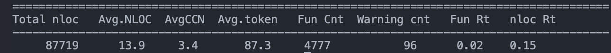

# Metrics

### 1. Lines of Code (LOC)
The total lines of code in the project is **454,180**. This includes all code across different languages and file types, as shown in the table above. The largest contributors are Unity-Prefab files (324,525 LOC) and C# files (88,502 LOC), reflecting the project's heavy reliance on Unity and C# for game development.

### 2. Number of Source Files
The project contains a total of **1,400** source files. The majority of these are C# files (821) and Unity-Prefab files (388), with additional files in formats such as XML, HLSL, HTML, and others.

### 3. Average Cyclomatic Complexity Number (CCN)
The project maintains a healthy average cyclomatic complexity of **3.4**, which is well within the recommended threshold (typically < 10). This metric measures the number of linearly independent paths through the code, essentially counting the number of different routes the program execution can take.

### 4. Other Metrics
Additional code quality metrics show positive indicators for the project:
- **Project Scale**: 4,777 total functions with an average of 87.3 tokens per function
- **Function Size**: Average of 13.9 lines per function, indicating well-modularized code

These metrics collectively suggest a well-structured, maintainable, and professionally developed codebase.

<!-- ### 3. Number of Dependencies
The number of dependencies is not directly shown in the Cloc.png metrics. To determine the exact number of dependencies, you would typically check the project's package management files (such as `Packages/manifest.json` for Unity projects or `*.csproj` files for C#). Please refer to these files for a precise count of external libraries and packages used in the project. -->

