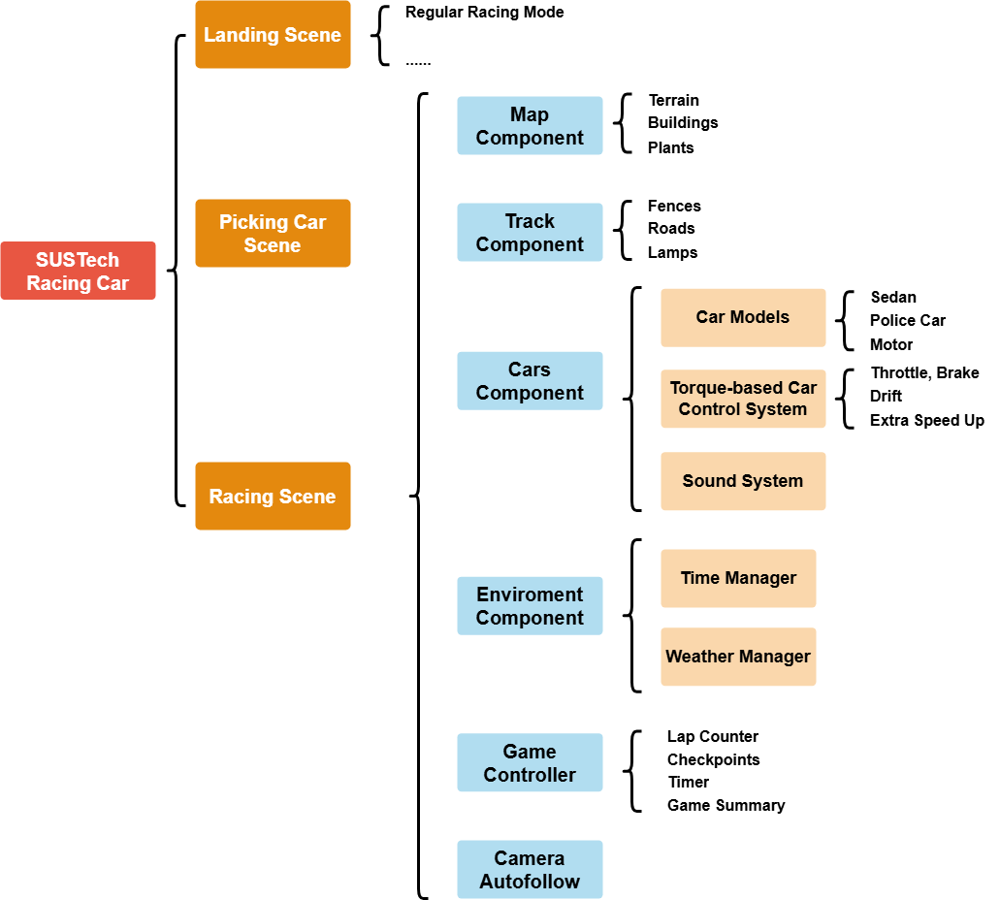

# Sprint 1 Design Report - Team [88]

<!-- Replace [teamID] with your team number, e.g., Team01 -->

<!-- Example: # Sprint 1 Design Report - Team01 -->

## 1. Architecture Design

<!-- Ensure this architecture diagram (e.g., architecture_diagram.png) has been uploaded to the images/ folder in your GitHub repository -->

<!-- If the image filename or path differs, modify accordingly, e.g.,  -->

**Diagram Description**:
<!-- AI-generated-content  -->
<!-- tool: ChatGPT -->
<!-- version: 4o -->
  
As illustrated in the above figure, the project currently consists of three scenes: `Landing Scene`, `Picking Car Scene`, `Racing Scene`.
#### 1.1 Landing Scene 
The initial interface presented to users when the game starts. It allows players to choose different game modes. At current stage, only `Regular Racing Mode` is available.

#### 1.2 Picking Car Scene  
Enables users to browse and select their preferred vehicle before entering the race. It reuses the car models in `Racing Scene`.

#### 1.3 Racing Scene  
The main interactive environment where the race takes place. All modes share the same racing scene. It consists of several critical components:

- **Map Component**: Defines the spatial structure of the game environment, including terrain, buildings and plants. **Note**: This component is built on the basis of [Real World Terrain](https://assetstore.unity.com/packages/tools/terrain/real-world-terrain-8752).

- **Track Component**: Sub-module responsible for the track-related design, including fences, roads and lamps. **Note**: This component is built on the basis of [EasyRoads 3D](https://www.easyroads3d.com/).

- **Cars Component**: Handles the configuration, spawning, and control logic for all in-game vehicles. **Note**: This component is built on the basis of [Arcade car physics](https://assetstore.unity.com/packages/tools/physics/arcade-car-physics-119484).

- **Environment Component**: Manages the environmental context of the race such as lighting, weather, and dynamic changes.

- **Game Controller**: Acts as the central hub for managing game states, checkpoint recovering, and coordination among subsystems.

- **Camera Autofollow**: Provides dynamic camera tracking by following the player's car with smooth and intuitive movement.

#### 1.4 Additional Notes  
The current architecture focuses on single-player gameplay and does not yet consider multiplayer online functionality. If multiplayer support is needed in the future, network synchronization components can be introduced. Additionally, the weather and day/night effects in the environment system are only implemented with basic functionality in Sprint 1, with further optimizations planned for future iterations.

<!-- Modify the architecture type (e.g., MVC, client-server architecture) based on your project's actual situation -->

<!-- Update the component list and their functional descriptions, e.g.: -->

<!-- - **Input Manager**: Handles keyboard and mouse input -->

<!-- - **Physics Engine**: Simulates vehicle movement -->

<!-- Describe how components interact, e.g., via API calls or message passing -->

<!-- Add other relevant notes, e.g.: -->

<!-- - The current architecture is not optimized for mobile performance and may be adjusted in the future -->

<!-- - Certain modules (e.g., AI system) will be implemented in Sprint 2 -->

## 2. User Interface (UI) Design

We used Figma to create basic UI design, please visit the follwoing link to access:

> https://www.figma.com/design/S9mFf9fV5JlrUs7myfzZ13/SUSTech-Racing-Car-Wireframing?node-id=1059171-91&m=dev&t=z6tRH05L9atGP2rv-1

## 3. Project Progress

1. **SUSTech Campus Racing Map & UI** (6/10)
   
   Race through a detailed and immersive map inspired by SUSTech’s campus.

2. **Advanced Track Design**  (1/2)
   
   User-friendly tracks for beginners and hidden shortcuts for strategic gameplay.

3. **Multiple Game Modes**  (4/25)
   - **Regular Racing Mode**: Classic racing for speed enthusiasts.  
   - **Item Race**: Use power-ups and items to outsmart opponents.  
   - **Exploration Mode**: Freely explore the campus map and discover hidden secrets.  
   - **Online Competition Mode**: Compete with your friends in real-time.  
   - **Electric Vehicles vs Security Guard (PvE Mode)**: A unique player-vs-environment challenge.

4. **Dynamic Weather & Time System**  (4/6)
   
   Experience realistic changes in weather (rain, fog, etc.) and time (day/night cycles) that affect gameplay.

5. **Themed Vehicles** (3/4) 
   
   Select from a variety of department- or college-themed cars, each featuring unique power-ups, to enrich your driving experience and gain strategic advantages in races.

6. **Realistic Driving Experience** (4/4)  
   
   Provides torque-based control systems, realistic driving sounds, speed-up mechanisms, and drift mechanisms.

7. **Multi-View Switching & Recording** (0/2) 
   
   Switch between different camera angles (e.g., first-person, third-person) and record your best moments.