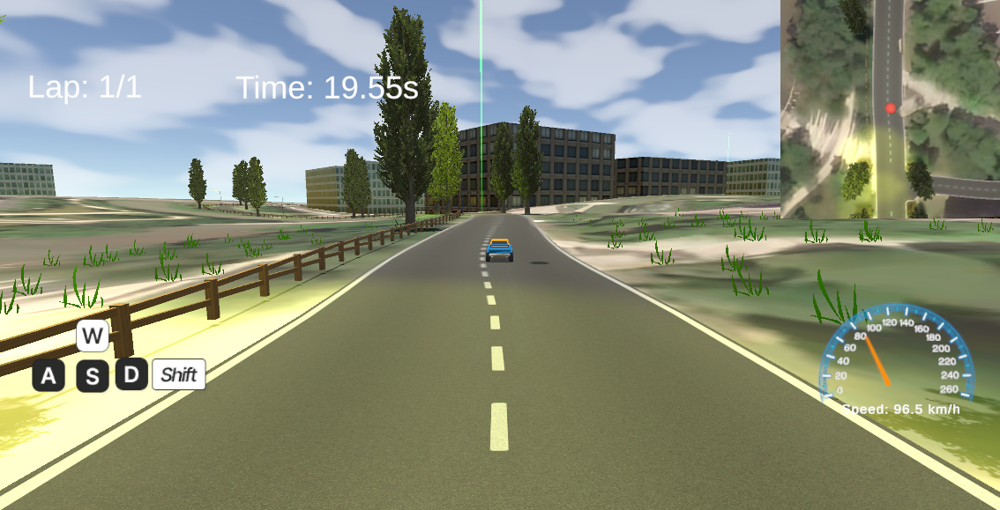
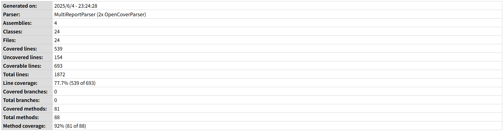

# SUSTech Car Racing Game

---

# Features

1. **SUSTech Campus Racing Map & UI**  
   Race through a detailed and immersive map inspired by SUSTech’s campus.

2. **Regular Racing Mode**  
   Classic time trial mode for speed enthusiasts. We offer multiple themed cars with different driving experiences to suit your preferences! 

3. **Item Race**  
   A solo time trial mode with item boxes—collect random power-ups to boost your performance or add challenges.

4. **Electric Vehicles vs Security Guard (PvE Mode)**  
   Outrun an AI-controlled security guard in this thrilling PvE challenge—get caught and the race is over!

5. **Racing with Friends**  
   Connect with your friends via local networks and have a race together!

6. **Dynamic Weather & Time System**  
   Experience realistic changes in weather (rain, fog, etc.) and time (day/night cycles) that affect gameplay.

7. **Realistic Driving Experience**  
   Provides torque-based control systems, realistic driving sounds, speed-up mechanisms, and drift mechanisms.

# Metrics

### 1. Lines of Code (LOC)

The total lines of code in the project is **454,180**. This includes all code across different languages and file types, as shown in the table above. The largest contributors are Unity-Prefab files (324,525 LOC) and C# files (88,502 LOC), reflecting the project's heavy reliance on Unity and C# for game development.

### 2. Number of Source Files

The project contains a total of **1,400** source files. The majority of these are C# files (821) and Unity-Prefab files (388), with additional files in formats such as XML, HLSL, HTML, and others.

### 3. Average Cyclomatic Complexity Number (CCN)

The project maintains a healthy average cyclomatic complexity of **3.4**, which is well within the recommended threshold (typically < 10). This metric measures the number of linearly independent paths through the code, essentially counting the number of different routes the program execution can take.

### 4. Dependency Analysis

Our project's dependency structure reveals a well-organized architecture with clear separation between core systems. Our main functionality relies on the following **12** core dependencies.

- **Core Unity Dependencies**
  The project properly leverages Unity's foundation frameworks:
  
  - **UnityEngine**: Core engine functionality used throughout the project
  - **MonoBehaviour**: Base class for Unity scripting, appropriately extended in our components
  - **UnityEngine.UI**: Used for interface elements and HUD components
  - **UnityEngine.SceneManagement**: Handles scene transitions and level loading operations

- **System Dependencies**
  Standard .NET libraries utilized for fundamental operations:
  
  - **System.Collections**: Used for core collection data structures
  - **System.Collections.Generic**: Provides type-safe collections throughout the codebase
  - **System.Text**: Utilized for string manipulation and text processing

- **Custom Component Dependencies**
  Our project's custom architecture shows sensible organization around key game systems:
  
  - **VehicleBehaviour**: Core vehicle physics and handling components
  - **GameEffectUIManager**: Centralized management of UI effects and transitions
  - **AICarPathFollower**: AI movement and navigation system for computer-controlled vehicles

- **Testing Dependencies**
  The project maintains a solid testing infrastructure using:
  
  - **NUnit.Framework**: Primary testing framework for unit tests
  - **UnityEngine.TestTools**: Unity-specific testing utilities for play mode tests

### 5. Other Metrics

Additional code quality metrics show positive indicators for the project:

- **Project Scale**: 4,777 total functions with an average of 87.3 tokens per function
- **Function Size**: Average of 13.9 lines per function, indicating well-modularized code

These metrics collectively suggest a well-structured, maintainable, and professionally developed codebase.

<!-- ### 3. Number of Dependencies
The number of dependencies is not directly shown in the Cloc.png metrics. To determine the exact number of dependencies, you would typically check the project's package management files (such as `Packages/manifest.json` for Unity projects or `*.csproj` files for C#). Please refer to these files for a precise count of external libraries and packages used in the project. -->

---

# Documentation

## SUSTech Campus Racing Game User Manual

## Project Introduction

SUSTech Campus Racing Game is a racing game set on a 1:1 recreation of the Southern University of Science and Technology (SUSTech) campus. The game features multiple modes, including Classic Racing, Multiplayer Racing, Item Racing, and AI Chase. Players can explore the campus, learn about its layout, and enjoy a realistic weather system that brings the campus to life under various conditions.

The main goal of the game is to help students and players become more familiar with the SUSTech campus while having fun. All campus buildings and landmarks are faithfully recreated, providing an immersive and educational experience.

## Basic Controls

- **W/A/S/D**: Move/Steer your vehicle
- **Shift**: Boost/Accelerate
- **R**: Return to the last checkpoint
- **J**: Jump
- **1**: Switch to third-person view
- **2**: Switch to first-person view

## Game Modes

### Classic Racing Mode

In the main menu, click **Regular Race** to enter Regular Racing Mode. In Classic Racing Mode, players start in front of the Third Teaching Building and race along the route of SUSTech Bus Line 1, returning to the starting point to complete the race. To ensure fair play and encourage campus exploration, there are barriers only on the outer edge of the track. Six checkpoints are placed along the route; players must pass through all checkpoints for their results to be recorded. If you get lost, press **R** to return to the last checkpoint.

### Multiplayer Racing Mode

In the main menu, click **Race with Friends** to enter Multiplayer Racing Mode. In Multiplayer Racing Mode, one player should click "Host Game" to create a room. Other players on the same local network can join by entering the host's IP address and the auto-generated password. Once all players are ready, the host can start the race. The rules are the same as in Classic Racing Mode.

### Item Racing Mode

In the main menu, click **Item Race** to enter Item Racing Mode. Item Racing Mode is similar to Classic Racing, but with a twist: mysterious item boxes are randomly placed on the track. When a player passes through a box, they receive a random effect, such as car spinning, stopping, speed up, slow down, or reversed controls (left/right).

### AI Chase Mode

In the main menu, click **Item Race** to enter AI Chase Mode. In AI Chase Mode, players must escape from computer-controlled chasers and try to finish the race without being caught. Similarly, compared to other modes, you can see the positions of computer-controlled opponents displayed in the bottom-left corner of the screen in real-time. Additionally, a distance indicator at the top of the screen shows how far the computer-controlled chasers are from you, allowing you to plan your escape route or adjust your strategy to avoid being caught.

### Enjoy Exploring SUSTech!

Experience the campus in all weather conditions, discover every building, and challenge yourself and your friends in various racing modes. Have fun and get to know SUSTech like never before!

## SUSTech Campus Racing Game Development for developers

Our API development documentation is located at [API Documentation](./team_project/_site/Global.html "API Documentation"). The API documentation provides a detailed explanation of the role and type of each variable and method within each class.

---

# Test

## Automated Testing Frameworks and Tools

We used the following technologies to implement automated testing in our Unity project:

- **Unity Test Framework (UTF)**: For writing and running **EditMode** and **PlayMode** tests.
- **NUnit**: As the underlying assertion framework used by UTF (e.g., `Assert.AreEqual`, `Assert.IsTrue`).
- **Unity Code Coverage package** (`com.unity.testtools.codecoverage`): To generate HTML-based test coverage reports.
- **GitHub Actions CI**: We integrated automated test execution and code coverage reporting into CI/CD using the `game-ci/unity-test-runner` and `upload-artifact` GitHub Actions.

## Source Code / Test Artifacts

You can find our test code and CI pipeline in the following locations:

- **PlayMode Tests**: [`Assets/Tests/PlayMode/`](https://github.com/sustech-cs304/team-project-25spring-88/tree/main/team_project/Assets/Tests/PlayMode)
- **EditMode Tests** (if applicable): [`Assets/Tests/EditMode/`](https://github.com/sustech-cs304/team-project-25spring-88/tree/main/team_project/Assets/Tests/EditMode)
- **CI Configuration**: [`.github/workflows/main.yml`](https://github.com/sustech-cs304/team-project-25spring-88/blob/main/.github/workflows/main.yml)
- **Sample Test Report Artifact**: [Code Coverage Report](https://github.com/sustech-cs304/team-project-25spring-88/actions/runs/15442882951)

## Effectiveness of Tests

We evaluated the effectiveness of our tests using **code coverage analysis**, which measures how much of our production code is exercised by the test suite.

- **Coverage Tool**: Unity Code Coverage (HTML report generated).
- **Included Assemblies**: `CommonScripts`, `ItemSystem`, `LandingScripts`, `PlayMode`.
- **Sample Output**:
  

Based on the sample report, the overall **line coverage** of our project reached **77.7%**, furthermore, the **method coverage** is even higher, achieving **92%**.

This demonstrates that the majority of our gameplay and UI logic has been validated through automated testing. Core systems such as `WeatherSystem`, `GameEffectUIManager`, `ItemBox`, and `PlayMode` were tested under various usage scenarios to ensure their robustness.

---

# Build

Since our project is developed using the Unity engine, the build process is simple and efficient. The Build Settings window contains all the necessary settings and options for publishing builds to various platforms. From this window, you can create development builds for testing or publish the final release version. To adjust the build settings for your application, go to **File > Build Settings**. For more detailed information, please refer to the [Unity Documentation](https://docs.unity3d.com/cn/2022.3/Manual/PublishingBuilds.html).

---

# Depolyment

The project is built using Unity’s WebGL platform and deployed on [Unity Play](https://play.unity.com/en/games/c5673d05-d1a8-4303-a22a-406a40222038/sustech-car-racing), allowing users to easily access and play the game directly through a web browser without the need for any installation. This ensures fast and universal access across most modern devices.

In addition to WebGL deployment, the Unity engine also supports building native executable files for a variety of platforms and system architectures, including Windows, macOS, Android, and iOS. This flexibility allows the project to be distributed in multiple formats depending on user needs or deployment environments.
